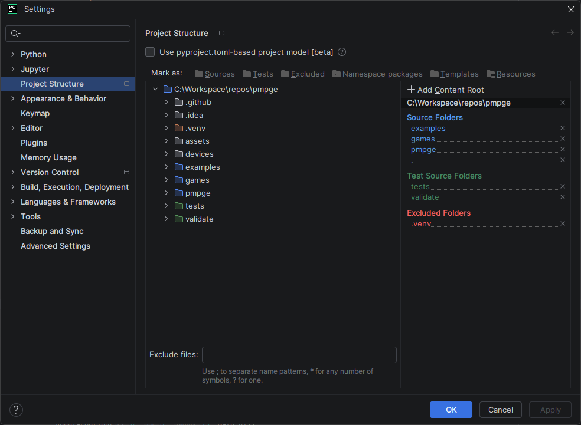

# Python Multi-Platform Game Engine (pmpge)

An easy-to-use Game Engine that works with Pygame Zero on desktop computers and also with
CircuitPython and MicroPython devices. It is designed for use in Coding Clubs.

Please see my website [Code Club Adventures](http://codeclubadventures.com/) for more coding
materials.

## Overview

This project originated from a desire to make it as simple as possible for students at my
coding club to make their own games in Python using Pygame Zero. There were two primary
drivers:

1. Remove the need to write the same common code in each game.
2. Avoid the need to modify code from earlier steps, focussing on incremental addition
   rather than modification

So why these aims? Removing the need to write the same common code in each game is boring
for the students and takes up time that is better spent being creative writing new code.
The aim is to allow the students to focus on the game and not the "engine".

Python is a great language for beginnings to start with but even so, writing Python code
can be hard for all newcomers. It is easy to get your indentation wrong or mix parentheses
with brackets. It's even harder to go back and change code you've already written, particularly
if you have modified or extended that code from the original. When students break and then cant
fix their previously working program it leads to frustration and loss of confidence.

It is also difficult to write clear and concise instructions explaining how to modify existing
code. It can very quickly get verbose and hard to follow. I therefore try to avoid this where
possible and focus on incremental addition of new code rather than modification of existing code.

The origins of this project are from the Python Pygame Zero games that I have written for my
coding club. Head over
to [Code Club adventures - games with Pygame Zero](https://codeclubadventures.co.uk/advancing/#games-with-pygame-zero)
to take a look.

A stretch goal for this project is to abstract the underlying host platform (Pygame Zero) so
that support can be added relatively easily for other environments at a later date. The other
environments are primarily CircuitPython and MicroPython which already provide a great hardware
abstraction layer. The driver for this is that writing games for these devices is tricky in a
Code Club other that using the MakeCode platform as the code/test cycle is tiresome and tricky
for young and inexperienced people. This framework aims to make development easy on a desktop
which can then be easily copied across to the device. The main limitation is RAM but with the
new Pico 2350 and ESP32 S3 boards offering 2Mb or more of RAM, it is not the limitation is
once was.

## Project structure

The structure of the `pmpge`project is arranged in the following files (listed in order of
importance):

* `controller.py`  - Provides a standard controller abstraction offering different "levels" of
  controller so games can adapt to what the environment offers.
* `environment.py` - Provides information about the environment the engine is operating in such
  as whether it is running on a desktop or microcontroller and which type of Python.
* `game.py`        - Provides the `Game` class which is a helper class used to run the game.
* `game_object.py` - Provides the `GameObject` class which is the basis of `pmpge`.
* `graphics.py`    - Provides a standard graphics abstraction to support different environments.
* `palette.py`     - Provides the `Palette` class for managing colour palettes.
* `sound.py`       - Provides a standard sound abstraction to support different environments.
* `sprite.py`      - Provides the `Sprite` class which is used to represent a GameObject with
  position.
* `traits`         - Directory containing a range of traits that can be added to a `GameObject`.

Some sample games written using the `pmpge` framework can be found in `games` and examples
demonstrating how to use the framework can be found in `examples`.

## Setting up a Development Environment

The project has been developed using the [PyCharm IDE](https://www.jetbrains.com/pycharm/)
with a VENV for Python (using Python 3.12) with tests written using `pytest` (see
[pytest](https://docs.pytest.org/en/8.2.x/) for more information).

In PyCharm, the following "Project Structure" is used:

## Supporting CircuitPython and MicroPython

This is currently in the early feasibility stages and work is off the main branch so
no implementation details are available as these are changing too quickly. The aim
though is users of this framework will not need to make much in the way of changes
to simply run their games on one of the reference hardware devices. Naturally, RAM
and CPU resources are much more limited on these tiny devices but the main limitation
to be aware of is display resolution. Typically on these devices the screens will
have a resolution of either:

* 160 x 128 pixels
* 240 x 240 pixels
* 320 x 240 pixels
* 640 x 480 pixels

The framework will autoscale where possible so ideally, pick a game resolution of
either 160 x 120 or 320 x 240 and it should work on the reference target devices with
little or no modifications. Yes, with a 160 x 128 pixel display you lose 8 pixels but
that is the cost of maximum portability.

_**NOTE:** Please be aware that the initial releases of PMPGE will be validated for
functionality and ease of use rather than optimisation for performance on small devices.
Optimisation will come later._

### CircuitPython

On circuitPython, the supported display driver is to use displayio

* https://docs.circuitpython.org/en/latest/shared-bindings/displayio/
* https://learn.adafruit.com/circuitpython-display-support-using-displayio/introduction

### MicroPython

On MicroPython, the supported display driver is to use pico-graphics:

* https://github.com/pimoroni/pimoroni-pico/blob/main/micropython/modules/picographics/README.md

### Raspberry Pi with additional SPI screen/controller

For an interesting diversion, another aim is to be able to support a Raspberry Pi using
an additional SPI connected display. There are many HATs out there with screen and buttons
such as this one:

* https://www.amazon.co.uk/dp/B0DQXYJY4X?ref=cm_sw_r_cso_em_mwn_dp_BK5HK79X16XEKVJW77Z4&social_share=cm_sw_r_cso_em_mwn_dp_BK5HK79X16XEKVJW77Z4

### Reference hardware

The following are the reference commercial hardware devices that will be used to test the framework:

* Pimoroni [PicoSystem](https://shop.pimoroni.com/products/picosystem?variant=32369546985555) for
  CircuiPython and
  MicroPython* Adafruit [PyBadge](https://www.adafruit.com/product/4200) for CircuitPython
* Pimoroni [Badgeware Tufty](https://shop.pimoroni.com/products/tufty-2350?variant=55811986227579)
  with STEM kit for
  MicroPython

Additionally, I will make two reference systems using COTS parts using:

* Design 1:
    * Raspberry Pi Pico 2
    * Generic ST7735R 160 x 128 pixel display
    * 8 x Standard push buttons

* Design 2:
    *
    Pimoroni [Pico Plus 2](https://shop.pimoroni.com/products/pimoroni-pico-plus-2?variant=42092668289107)
    *
    Pimoroni [Pico Display 2.8"](https://shop.pimoroni.com/products/pico-display-pack-2-8?variant=42047194005587)

## License

All materials provided in this project is licensed under the Creative Commons
Attribution-NonCommercial-ShareAlike 4.0
International License. To view a copy of this license, visit
<https://creativecommons.org/licenses/by-nc-sa/4.0/>.

In summary, this means that you are free to:

* **Share** — copy and redistribute the material in any medium or format.
* **Adapt** — remix, transform, and build upon the material.

Provided you follow these terms:

* **Attribution** — You must give appropriate credit , provide a link to the license, and indicate
  if changes were made.
  You may do so in any reasonable manner, but not in any way that suggests the licensor endorses you
  or your use.
* **NonCommercial** — You may not use the material for commercial purposes.
* **ShareAlike** — If you remix, transform, or build upon the material, you must distribute your
  contributions under the
  same license as the original.